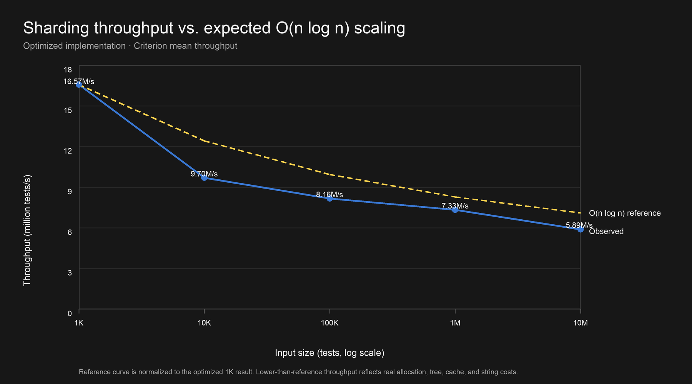

| Input size | Original heap | Current code | Less runtime | Speedup |
|---|---:|---:|---:|---:|
| 100,000 tests | 24.097 ms | **12.247 ms** | **49%** | **1.97×** |
| 1 million tests | 406.205 ms | **136.426 ms** | **66%** | **2.98×** |
| 10 million tests | 7.947 s | **1.698 s** | **79%** | **4.68×** |
| Comparison basis | Original: `stage-0` | Current: `round3-two-phase-small` | Ratios of recorded timings, measured in separate runs | Machine-specific |

| # | What we tried | Compared with | What happened | Kept? |
|---|---|---|---|---|
| 1 | Calculate max and sum together; remove temporary duration storage | Original heap | Saved 4 bytes/test, but 10M took **10.4% longer**. 100K improved 2.6%; 1M inconclusive. | **No** — slower on large input |
| 2 | Sort tests once, then pop from the end instead of using a heap | Original heap | Runtime fell **46.4% at 1M**, **68.3% at 10M**. All 9 workloads improved. | **Yes** |
| 3 | Create empty shards only when needed | #2 | Runtime fell 7.5% at 1M and 5.7% at 10M, but tied and skewed inputs took **~7% longer**. | **No** — regressions elsewhere |
| 4 | Keep shard contents in a vector; keep only capacity and ID in the search tree | #2, freshly measured | Runtime fell **8.3% at 1M**, **7.6% at 10M**. All 11 workloads improved. | **Yes** |
| 5 | Remove full shards from the search tree | #4 | Runtime fell **50.1% for tied durations**, 17.5% for half-capacity inputs, 2.0% at 1M, and 4.0% at 10M. Some inputs took up to 2.7% longer. | **Yes** — large targeted gains |
| 6 | Skip shard placement when everything fits in one shard | #5 | Single-shard runtime fell **51.5% at 1K**, **19.1% at 100K**. Regular 1M took 2.9% longer initially; repeat measured 1.4%. | **Yes** — repeat below 3% slowdown limit |
| 7 | Reserve estimated space in each shard upfront | #6, freshly measured | Runtime fell 4.8% at 1M and 2.0% at 10M, but buffer capacity for many zero-duration tests grew **35 MB → 84 MB**. | **No** — memory cost |
| 8 | Find and remove a shard in one tree operation (`extract_if`) | #6, freshly measured | Runtime fell **20.7% at 1M**, **18.0% at 10M**. All 12 workloads improved. | **Yes** — requires Rust 1.91+ |
| 9 | Pack capacity and ID into an 8-byte tree key, with a fallback for larger IDs | #8 | Keys shrank **16 → 8 bytes**. Runtime fell **8.0% at 1M**, **7.3% at 10M**. Largest small-input slowdown: 1.2%. | **Yes** |
| 10 | Reorder output vectors in place | #9 | 10K took **4.5% longer**; other gains were only ~1%. Large runs skipped after this result. | **No** — slower |
| 11a | Sort by duration first, then sort IDs only within equal-duration groups | #9 | Special input patterns improved 5–14%; single-shard 100K improved 22.1%, but single-shard 1K took **15.1% longer**. Large runs skipped. | **No** — needed a small-input fix |
| 11b | Use #11a only above 1,024 tests; keep the original sort below that | #9 | Fixed the single-shard 1K regression. Single-shard 100K improved **21.8%**; special patterns improved 5–15%; 1M improved 2.2%; 10M unchanged. Largest slowdown: 1.5%. | **Yes** — refined #11a |

| Supporting measurement | Result | Meaning |
|---|---|---|
| Reading the experiment table | Each percentage is the runtime change versus the version in “Compared with.” | Improvements are incremental; **do not add the percentages**. The first table shows total improvement versus the original. |
| Input patterns | Short durations; durations around half a shard’s capacity; equal durations (“ties”); uneven durations (“skewed”); many zero durations. | Checks that a win on random inputs also works on other shapes. |
| First baseline (`pre-opt`) | 1K: 90.07 µs; 10K: 1.751 ms; 100K: 23.877 ms. | Initial original-heap measurement. |
| Expanded baseline (`stage-0`) | 100K: 24.097 ms; 1M: 406.205 ms; 10M: 7.947 s. | Original-heap reference for #1–3 and the total comparison above. |
| Fresh baseline after #2 (`round2-base`) | 100K: 18.332 ms; 1M: 210.873 ms; 10M: 2.533 s. Single-shard: 1K 31.832 µs; 100K 6.211 ms. | Reference for #4–6. |
| Combined #4–6 | All 11 workloads improved; 1M runtime fell **7.6%**, 10M **10.8%**. | Compared with the fresh baseline after #2. |
| Fresh baseline after #6 (`round3-base`) | 100K: 16.659 ms; 1M: 191.379 ms; 10M: 2.239 s. | Reference before the last five ideas (#7–11). |
| Combined #8, #9, #11b | All 12 workloads improved; 100K runtime fell **26.5%**, 1M **28.7%**, 10M **24.2%**. | Compared with the fresh baseline after #6. Last five ideas: **3 kept, 2 rejected**. |
| Time spent after #2, at 1M tests | Placement: 165–171 ms; sorting: 46–47 ms; all other phases combined: about 15–17 ms. | Three isolated diagnostic runs showed placement was the next bottleneck. An overlapping probe was excluded. |
| Repeat check for #6 | Regular 1M: 193.46 ms with fast path vs 190.70 ms without it: **1.4% longer** (95% interval: 0.9–2.0%). | Fresh reverse-order runs, 100-second measurement windows; below the 3% slowdown limit. |
| Memory check for #7 | Buffer capacity: random 100K **6.4 → 4.8 MB**; random 1M **64.1 → 32.3 MB**; zero-heavy 1M **34.8 → 84.4 MB**. | Reservation helps some inputs but hurts others. Counts inner-vector capacity only, not peak process memory. |
| Correctness | **13 tests pass in debug and release**. Includes 38,220 exhaustive cases, 501 randomized/boundary cases, both key formats, and cases around the sort cutoff. | Exact output matches the original; preservation, capacity, and zero-capacity panic behavior checked. Each candidate passed its applicable suite. |
| Measurement setup | Criterion; Rust/Cargo 1.98.1; Apple ARM64; sequential runs; locked dependencies; unchanged original generator and benchmark settings. | Results are specific to this machine. Separate runs can drift; confidence intervals do not rule that out. |
| Raw benchmark records | Local `target/criterion`: `stage-1/2/3`; `round2-index/completed/single`; `round3-reserve/extract/packed/reorder/two-phase/two-phase-small`. | Map to experiment rows in order. Confirmation: `round2-single-confirm` and `round2-completed-confirm`. Records are untracked. |
